<!-- Danilo Herrera · @dnnyhr — Dirección B · Editorial -->

<picture>
  <source media="(prefers-color-scheme: dark)" srcset="./assets/dark/hero.svg">
  
</picture>

<picture>
  <source media="(prefers-color-scheme: dark)" srcset="./assets/dark/sec-about.svg">
  
</picture>

<picture>
  <source media="(prefers-color-scheme: dark)" srcset="./assets/dark/about.svg">
  
</picture>

<picture>
  <source media="(prefers-color-scheme: dark)" srcset="./assets/dark/sec-stack.svg">
  
</picture>

<picture>
  <source media="(prefers-color-scheme: dark)" srcset="./assets/dark/stack.svg">
  
</picture>

<picture>
  <source media="(prefers-color-scheme: dark)" srcset="./assets/dark/sec-projects.svg">
  
</picture>

<a href="https://piko.mugiware.com">
<picture>
  <source media="(prefers-color-scheme: dark)" srcset="./assets/dark/project-piko.svg">
  
</picture>
</a>

<a href="https://piko.mugiware.com"><picture>
  <source media="(prefers-color-scheme: dark)" srcset="./assets/dark/btn-piko.svg">
  
</picture></a>

<a href="https://inventory.xinocore.com">
<picture>
  <source media="(prefers-color-scheme: dark)" srcset="./assets/dark/project-inventory.svg">
  
</picture>
</a>

<a href="https://inventory.xinocore.com"><picture>
  <source media="(prefers-color-scheme: dark)" srcset="./assets/dark/btn-inventory.svg">
  
</picture></a>

<a href="https://gym.xinocore.com">
<picture>
  <source media="(prefers-color-scheme: dark)" srcset="./assets/dark/project-gym.svg">
  
</picture>
</a>

<a href="https://gym.xinocore.com"><picture>
  <source media="(prefers-color-scheme: dark)" srcset="./assets/dark/btn-gym.svg">
  
</picture></a>

<picture>
  <source media="(prefers-color-scheme: dark)" srcset="./assets/dark/sec-stats.svg">
  
</picture>

<picture>
  <source media="(prefers-color-scheme: dark)" srcset="https://github-readme-stats.vercel.app/api?username=dnnyhr&show_icons=true&include_all_commits=true&count_private=true&hide_border=true&bg_color=00000000&title_color=d6a66a&text_color=f0ebe3&icon_color=d6a66a&ring_color=d6a66a&locale=es">
  
</picture>
<picture>
  <source media="(prefers-color-scheme: dark)" srcset="https://streak-stats.demolab.com?user=dnnyhr&hide_border=true&background=00000000&ring=d6a66a&fire=d6a66a&currStreakNum=f0ebe3&sideNums=f0ebe3&currStreakLabel=d6a66a&sideLabels=a39d93&dates=a39d93&stroke=3a3631&locale=es">
  
</picture>
<picture>
  <source media="(prefers-color-scheme: dark)" srcset="https://github-readme-stats.vercel.app/api/top-langs/?username=dnnyhr&layout=compact&langs_count=8&hide_border=true&bg_color=00000000&title_color=d6a66a&text_color=f0ebe3&locale=es">
  
</picture>
  
<picture>
  <source media="(prefers-color-scheme: dark)" srcset="https://komarev.com/ghpvc/?username=dnnyhr&label=N%C2%BA%20DE%20VISITANTES&color=d6a66a&labelColor=15181d&style=flat-square&abbreviated=true">
  
</picture>

<picture>
  <source media="(prefers-color-scheme: dark)" srcset="./assets/dark/sec-snake.svg">
  
</picture>

<picture>
  <source media="(prefers-color-scheme: dark)" srcset="https://raw.githubusercontent.com/dnnyhr/dnnyhr/output/github-snake-dark.svg">
  
</picture>

<picture>
  <source media="(prefers-color-scheme: dark)" srcset="./assets/dark/contrib-legend.svg">
  
</picture>

<picture>
  <source media="(prefers-color-scheme: dark)" srcset="https://github-readme-activity-graph.vercel.app/graph?username=dnnyhr&bg_color=00000000&color=a39d93&line=d6a66a&point=f0ebe3&area=true&area_color=d6a66a&hide_border=true&radius=2&custom_title=Actividad%20%C2%B7%20%C3%BAltimos%2031%20d%C3%ADas&title_color=f0ebe3">
  
</picture>

<picture>
  <source media="(prefers-color-scheme: dark)" srcset="./assets/dark/sec-experience.svg">
  
</picture>

<picture>
  <source media="(prefers-color-scheme: dark)" srcset="./assets/dark/timeline.svg">
  
</picture>

<picture>
  <source media="(prefers-color-scheme: dark)" srcset="./assets/dark/sec-learning.svg">
  
</picture>

<picture>
  <source media="(prefers-color-scheme: dark)" srcset="./assets/dark/learning.svg">
  
</picture>

<picture>
  <source media="(prefers-color-scheme: dark)" srcset="./assets/dark/sec-contact.svg">
  
</picture>

<picture>
  <source media="(prefers-color-scheme: dark)" srcset="./assets/dark/footer.svg">
  
</picture>

<a href="https://xinocore.com"><picture>
  <source media="(prefers-color-scheme: dark)" srcset="./assets/dark/btn-web.svg">
  
</picture></a>&nbsp;
<a href="https://instagram.com/dnnyherrod"><picture>
  <source media="(prefers-color-scheme: dark)" srcset="./assets/dark/btn-ig.svg">
  
</picture></a>
 
<a href="mailto:DaniloHerrera@xinocore.com"><picture>
  <source media="(prefers-color-scheme: dark)" srcset="./assets/dark/btn-email.svg">
  
</picture></a>&nbsp;
<a href="https://www.linkedin.com/in/danilo-herrera-a9359a43b/"><picture>
  <source media="(prefers-color-scheme: dark)" srcset="./assets/dark/btn-linkedin.svg">
  
</picture></a>

Fotos: Mario Heller, Russ Murray y Luis Reyes en Unsplash.

